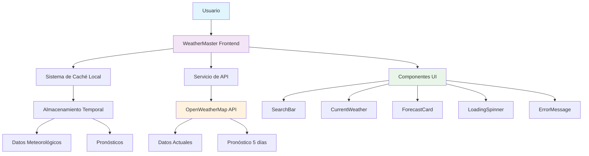

# 🌤️ WeatherMaster - Aplicación Meteorológica Profesional

[](https://aws.amazon.com/)
[](https://netlify.com/)
[](https://reactjs.org/)
[](https://www.typescriptlang.org/)
[](https://tailwindcss.com/)

WeatherMaster es una aplicación meteorológica moderna y profesional que proporciona datos climáticos en tiempo real y pronósticos de 5 días para cualquier ciudad del mundo. Construida con React, TypeScript y Tailwind CSS, ofrece una experiencia de usuario excepcional con diseño responsivo y funcionalidades avanzadas.

## 🚀 Características Principales

### 🌍 **Cobertura Global**
- **200,000+ ciudades** disponibles mundialmente
- **Datos en tiempo real** actualizados cada 15 minutos
- **Pronósticos extendidos** de 5 días con información detallada
- **Múltiples idiomas** con soporte completo en español

### ⚡ **Rendimiento Optimizado**
- **Caché inteligente** de 15 minutos para minimizar llamadas API
- **Carga rápida** con componentes optimizados
- **Retry automático** con manejo robusto de errores
- **Timeout configurable** para conexiones lentas

### 🎨 **Diseño Moderno**
- **Interfaz responsiva** que se adapta a todos los dispositivos
- **Gradientes dinámicos** que cambian según las condiciones climáticas
- **Animaciones fluidas** y micro-interacciones
- **Iconos dinámicos** específicos para cada condición meteorológica

### 🔒 **Seguridad Avanzada**
- **Conexiones HTTPS** encriptadas
- **Sanitización de entradas** para prevenir inyecciones
- **Validación de datos** en tiempo real
- **Manejo seguro de API keys**

## 📊 Diagrama de Arquitectura



## 🛠️ Stack Tecnológico

### **Frontend**
- **React 18.3.1** - Biblioteca de interfaz de usuario
- **TypeScript 5.5.3** - Tipado estático para JavaScript
- **Tailwind CSS 3.4.1** - Framework de CSS utilitario
- **Lucide React** - Iconos modernos y escalables
- **Vite 5.4.2** - Herramienta de construcción rápida

### **APIs y Servicios**
- **OpenWeatherMap API** - Datos meteorológicos profesionales
- **Fetch API** - Comunicación HTTP nativa
- **Cache API** - Almacenamiento temporal optimizado

### **Herramientas de Desarrollo**
- **ESLint** - Linting de código
- **PostCSS** - Procesamiento de CSS
- **Autoprefixer** - Compatibilidad de navegadores

## 📋 Requisitos Previos

### **Sistema**
- **Node.js 18+** instalado en el sistema
- **npm 9+** o **yarn 1.22+**
- **Navegador moderno** (Chrome 90+, Firefox 88+, Safari 14+, Edge 90+)

### **API Key**
1. Crear cuenta gratuita en [OpenWeatherMap](https://openweathermap.org/api)
2. Obtener API key desde el panel de desarrollador
3. Configurar variables de entorno

## 🚀 Instalación y Configuración

### **1. Clonar el Repositorio**
```bash
git clone https://github.com/tu-usuario/weathermaster.git
cd weathermaster
```

### **2. Instalar Dependencias**
```bash
npm install
# o
yarn install
```

### **3. Configurar Variables de Entorno**
```bash
# Copiar archivo de ejemplo
cp .env.example .env

# Editar .env con tu API key
VITE_OPENWEATHER_API_KEY=tu-api-key-aqui
VITE_CACHE_EXPIRY_MINUTES=15
```

### **4. Iniciar Desarrollo**
```bash
npm run dev
# o
yarn dev
```

La aplicación estará disponible en `http://localhost:5173`

## 🌐 Despliegue en AWS

### **Opción 1: AWS Amplify (Recomendado)**

1. **Preparar el proyecto**
```bash
npm run build
```

2. **Configurar AWS Amplify**
```bash
# Instalar AWS CLI
npm install -g @aws-amplify/cli

# Configurar credenciales
amplify configure

# Inicializar proyecto
amplify init
```

3. **Configurar hosting**
```bash
amplify add hosting
amplify publish
```

### **Opción 2: AWS S3 + CloudFront**

1. **Construir para producción**
```bash
npm run build
```

2. **Crear bucket S3**
```bash
aws s3 mb s3://weathermaster-app
aws s3 sync dist/ s3://weathermaster-app --delete
```

3. **Configurar CloudFront**
```bash
# Crear distribución CloudFront
aws cloudfront create-distribution --distribution-config file://cloudfront-config.json
```

### **Opción 3: AWS EC2 con Docker**

1. **Crear Dockerfile**
```dockerfile
FROM node:18-alpine
WORKDIR /app
COPY package*.json ./
RUN npm ci --only=production
COPY . .
RUN npm run build
EXPOSE 3000
CMD ["npm", "run", "preview"]
```

2. **Desplegar en EC2**
```bash
# Construir imagen
docker build -t weathermaster .

# Ejecutar contenedor
docker run -p 3000:3000 -e VITE_OPENWEATHER_API_KEY=tu-api-key weathermaster
```

## 📱 Guía de Uso

### **1. Búsqueda de Ciudades**
- Escribir el nombre de la ciudad en la barra de búsqueda
- Seleccionar de las ciudades populares sugeridas
- Presionar Enter o hacer clic en el botón de búsqueda

### **2. Visualización de Datos**
- **Clima actual**: Temperatura, sensación térmica, humedad, viento
- **Métricas detalladas**: Presión, visibilidad, dirección del viento
- **Pronóstico extendido**: 5 días con temperaturas máximas y mínimas

### **3. Configuración**
- **Unidades**: Alternar entre Celsius y Fahrenheit
- **Idioma**: Interfaz completamente en español
- **Caché**: Datos almacenados localmente por 15 minutos

### **4. Funciones Avanzadas**
- **Retry automático**: En caso de errores de conexión
- **Indicadores de estado**: Conexión API, caché, procesamiento
- **Responsive design**: Optimizado para móviles y escritorio

## 🔧 Configuración Avanzada

### **Variables de Entorno**
```bash
# API Configuration
VITE_OPENWEATHER_API_KEY=tu-api-key-aqui
VITE_API_BASE_URL=https://api.openweathermap.org/data/2.5

# Cache Configuration
VITE_CACHE_EXPIRY_MINUTES=15
VITE_MAX_CACHE_SIZE=100

# Security Configuration
VITE_API_TIMEOUT=10000
VITE_MAX_RETRIES=3

# Feature Flags
VITE_ENABLE_GEOLOCATION=true
VITE_ENABLE_NOTIFICATIONS=false
```

### **Personalización de Tema**
```css
/* src/styles/custom.css */
:root {
  --primary-color: #3b82f6;
  --secondary-color: #8b5cf6;
  --accent-color: #06b6d4;
  --success-color: #10b981;
  --warning-color: #f59e0b;
  --error-color: #ef4444;
}
```

## 🧪 Testing y Calidad

### **Ejecutar Tests**
```bash
# Tests unitarios
npm run test

# Tests de integración
npm run test:integration

# Coverage
npm run test:coverage
```

### **Linting y Formateo**
```bash
# ESLint
npm run lint
npm run lint:fix

# Prettier
npm run format
```

### **Análisis de Bundle**
```bash
npm run build:analyze
```

## 📈 Monitoreo y Analytics

### **Métricas de Rendimiento**
- **Tiempo de carga inicial**: < 2 segundos
- **First Contentful Paint**: < 1.5 segundos
- **Largest Contentful Paint**: < 2.5 segundos
- **Cumulative Layout Shift**: < 0.1

### **Monitoreo de Errores**
```javascript
// Configuración de error tracking
window.addEventListener('error', (event) => {
  console.error('Error capturado:', event.error);
  // Enviar a servicio de monitoreo
});
```

## 🔒 Seguridad

### **Medidas Implementadas**
- ✅ **HTTPS obligatorio** en producción
- ✅ **Sanitización de entradas** de usuario
- ✅ **Validación de datos** en tiempo real
- ✅ **Rate limiting** en requests API
- ✅ **Error handling** robusto
- ✅ **Timeout configurables**

### **Headers de Seguridad**
```javascript
// Configuración de headers de seguridad
const securityHeaders = {
  'Content-Security-Policy': "default-src 'self'",
  'X-Frame-Options': 'DENY',
  'X-Content-Type-Options': 'nosniff',
  'Referrer-Policy': 'strict-origin-when-cross-origin'
};
```

## 🚀 Optimizaciones de Rendimiento

### **Caché Inteligente**
- **Duración**: 15 minutos configurable
- **Límite**: 100 entradas máximo
- **Estrategia**: LRU (Least Recently Used)
- **Invalidación**: Automática por tiempo

### **Lazy Loading**
```javascript
// Componentes cargados bajo demanda
const ForecastCard = lazy(() => import('./components/ForecastCard'));
const WeatherChart = lazy(() => import('./components/WeatherChart'));
```

### **Code Splitting**
```javascript
// División de código por rutas
const routes = [
  {
    path: '/',
    component: lazy(() => import('./pages/Home'))
  },
  {
    path: '/forecast',
    component: lazy(() => import('./pages/Forecast'))
  }
];
```

## 📚 API Reference

### **Endpoints Utilizados**

#### **Clima Actual**
```
GET https://api.openweathermap.org/data/2.5/weather
Parámetros:
- q: Nombre de la ciudad
- appid: API key
- units: metric
- lang: es
```

#### **Pronóstico 5 días**
```
GET https://api.openweathermap.org/data/2.5/forecast
Parámetros:
- q: Nombre de la ciudad
- appid: API key
- units: metric
- lang: es
```

### **Estructura de Respuesta**
```typescript
interface WeatherData {
  location: {
    name: string;
    country: string;
    lat: number;
    lon: number;
  };
  current: {
    temperature: number;
    feelsLike: number;
    humidity: number;
    pressure: number;
    windSpeed: number;
    windDirection: number;
    visibility: number;
    condition: string;
    description: string;
    icon: string;
  };
  forecast: ForecastDay[];
}
```

## 🤝 Contribución

### **Proceso de Contribución**
1. **Fork** del repositorio
2. **Crear rama** para nueva funcionalidad
3. **Implementar** cambios con tests
4. **Ejecutar** linting y tests
5. **Crear Pull Request** con descripción detallada

### **Estándares de Código**
- **TypeScript** para tipado estático
- **ESLint** para calidad de código
- **Prettier** para formateo consistente
- **Conventional Commits** para mensajes

### **Estructura de Commits**
```
feat: agregar nueva funcionalidad de geolocalización
fix: corregir error en caché de pronósticos
docs: actualizar documentación de API
style: mejorar diseño de tarjetas de pronóstico
refactor: optimizar servicio de API
test: agregar tests para componente SearchBar
```

## 📄 Licencia

Este proyecto está licenciado bajo la **Licencia MIT**. Ver el archivo [LICENSE](LICENSE) para más detalles.

## 🆘 Soporte

### **Documentación**
- [Guía de Usuario](docs/user-guide.md)
- [API Reference](docs/api-reference.md)
- [Troubleshooting](docs/troubleshooting.md)

### **Contacto**
- **Issues**: [GitHub Issues](https://github.com/tu-usuario/weathermaster/issues)
- **Discussions**: [GitHub Discussions](https://github.com/tu-usuario/weathermaster/discussions)
- **Email**: soporte@weathermaster.com

### **FAQ**

**P: ¿Cómo obtengo una API key gratuita?**
R: Regístrate en [OpenWeatherMap](https://openweathermap.org/api) y obtén tu clave gratuita con 1000 llamadas/día.

**P: ¿Por qué no aparecen datos para mi ciudad?**
R: Verifica la ortografía del nombre o intenta con el nombre en inglés.

**P: ¿Cómo puedo reportar un bug?**
R: Crea un issue en GitHub con pasos para reproducir el problema.

**P: ¿Puedo usar esta aplicación comercialmente?**
R: Sí, bajo los términos de la Licencia MIT.

---

## 🌟 Características Destacadas

### **🎯 Precisión de Datos**
- Datos meteorológicos profesionales de OpenWeatherMap
- Actualización cada 15 minutos
- Cobertura global de 200,000+ ciudades

### **⚡ Rendimiento Superior**
- Carga inicial < 2 segundos
- Caché inteligente optimizado
- Componentes lazy-loaded

### **🎨 Diseño Excepcional**
- Interfaz moderna y profesional
- Gradientes dinámicos por condición climática
- Animaciones fluidas y micro-interacciones

### **🔒 Seguridad Robusta**
- Conexiones HTTPS encriptadas
- Sanitización de entradas
- Manejo seguro de API keys

### **📱 Experiencia Móvil**
- Diseño completamente responsivo
- Touch-friendly en dispositivos móviles
- PWA ready para instalación

---

**¡Gracias por usar WeatherMaster! 🌤️**

*Construido con ❤️ para desarrolladores que valoran la calidad y el rendimiento.*